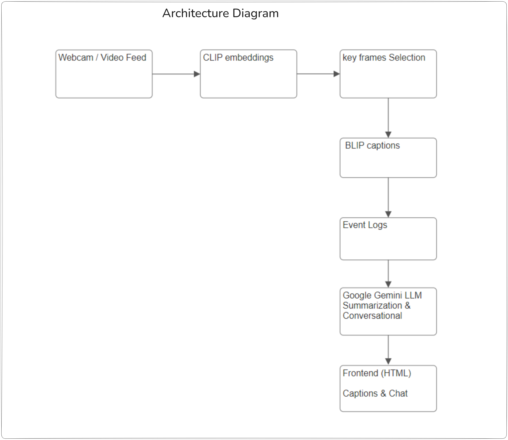
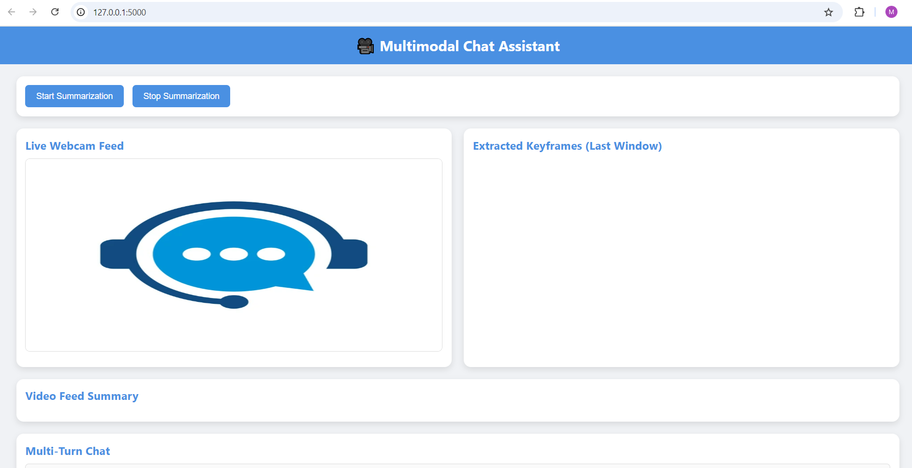

# 📌 Multimodal Chat Assistant Application

The **Multimodal Chat Assistant** is a Flask-based application that combines **computer vision** and **large language models (LLMs)** to provide real-time **video summarization, captioning, and conversational AI**.

It uses:

* **CLIP** for frame embeddings and keyframe selection.
* **BLIP** for image caption generation.
* **Google Gemini LLM** for text summarization and natural language conversation.
* A simple **Flask UI** for live video feed, summaries, and chat interface.

---

## 📝 Project Overview

The Multimodal Chat Assistant allows users to:

* Stream live video from a webcam.
* Automatically extract keyframes and generate captions.
* Summarize recent video events in natural language.
* Chat with an assistant that understands both video context and textual queries.

This makes it suitable for tasks like: video monitoring, content summarization, and interactive AI assistants.

---

## 🛠 Tech Stack Justification

| Component              | Technology          | Reasoning                                                        |
| ---------------------- | ------------------- | ---------------------------------------------------------------- |
| Video Processing       | OpenCV              | Efficient real-time webcam capture and frame processing.         |
| Embeddings             | CLIP (Hugging Face) | Robust multi-modal embeddings for image-text similarity.         |
| Caption Generation     | BLIP (Hugging Face) | Pretrained vision-language model for accurate image captioning.  |
| Conversational AI      | Google Gemini LLM   | State-of-the-art LLM for summarization and dialogue.             |
| Backend Framework      | Flask               | Lightweight, easy to integrate with AI models and serve HTML UI. |
| Environment Management | Python + dotenv     | Simple setup and configuration management.                       |

---

## 🛠 Architecture Diagram

[](docs/architecture.png)

---

## 🛠 UI Layout

[](docs/layout.png)

---

## 📂 Project Structure

```
Multimodal-Chat-Assistant/
│
├── app.py                     # Entry point to launch the app
├── config/
│   ├── config.py              # Configuration (models, server, API keys)
│   └── .env                   # Store GEMINI_API_KEY
│
├── src/
│   ├── interface/
│   │   ├── ui_main.py         # UIStarter (orchestrates app launch)
│   │   └── ui_backend.py      # Flask routes & backend logic
│   │
│   ├── models/
│   │   ├── model_setup.py     # Loads CLIP, BLIP, Gemini
│   │   └── model_infer.py     # Inference pipeline (embeddings, captions, summaries)
│   │
│   ├── llms/
│   │   └── gemini_client.py   # Gemini LLM wrapper
│   │
│   └── prompts/
│       └── prompt.py         # Prompt templates
│
├── templates/
│   └── index.html             # Frontend HTML (Flask renders this)
│
└── requirements.txt           # Python dependencies

```

---

## ⚙️ Installation

### 1. Clone the repository

```bash
git clone https://github.com/manishhnnegi/Multimodal-Chat-Assistant.git
cd multimodal-chat-assistant
```

### 2. Create a virtual environment

```bash
python -m venv venv
source venv/bin/activate   # Mac/Linux
venv\Scripts\activate      # Windows
```

### 3. Install dependencies

```bash
pip install -r requirements.txt
```

### 4. Setup environment variables

Create a `.env` file inside the **config/** folder:

```
GEMINI_API_KEY=your_google_gemini_api_key_here
```

---

## ▶️ Running the App

### Start the Flask app:

```bash
python app.py
```

The app will start at:
👉 `http://0.0.0.0:5000` (or `http://localhost:5000`)

---

## 💻 Usage

1. **Open the UI** → Go to `http://localhost:5000` in your browser.
2. **Start video capture** → Click the *Start* button to activate webcam.
3. **View live feed** → See real-time video from your webcam.
4. **Process video window** → Extracts keyframes + captions + summaries.
5. **Chat with Assistant** → Enter queries in the chat box. The assistant uses:

---
## 💻 Demo Video

Demo video is inside  the **docs/** folder:
1. 1_Demo_recording_Eval_dataset.mp4   -> Demo on one of the eval dataset video
2. 2_Demo_recording_multi_turn_feature.mp4 -> demo to show multi turn conversation ability

---

